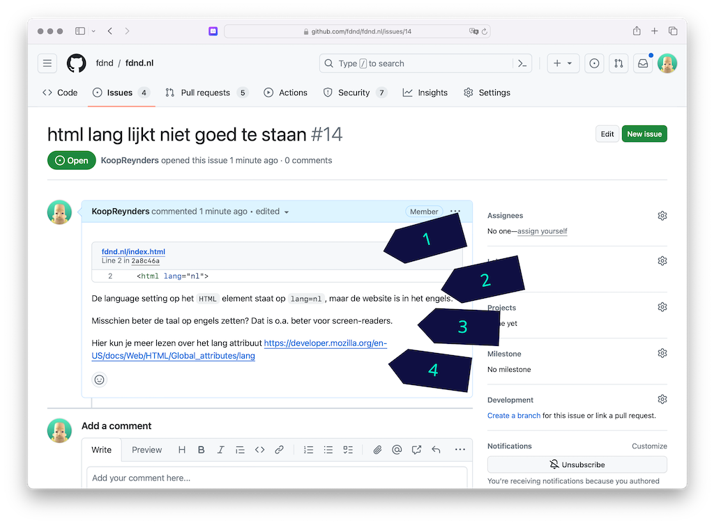

# Connect Your Tribe - Visitekaartje

## Code/Design-review over de NodeJS-code van je visitekaartje

Deze week heb je een visitekaartje ontworpen en gemaakt met NodeJS, een REST API en Liquid. Je hebt dynamische data gebruikt en je hebt een nieuw visitekaartje ontworpen en gebouwd. 
Is het gelukt? Cool he!?

### Aanpak
Vandaag krijg je feedback op je server-side code en een check op je client-side code.

## 1. Server-side code
Eerst ga je jouw server-side code uitleggen aan twee peers. Deze opdracht doe je dus met 3 personen. 

### Hardop uitleggen
Leg om de beurt jouw server-side code uit aan de anderen. Weet je iets niet? Helemaal niet erg, we zijn hier om te leren, maar schrijf daar dan meteen een comment bij om later uit te zoeken. 
- Begin met het `server.js` bestand uit te leggen; loop stap voor stap langs elke regel. 
- Ergens wordt JSON data geladen, weet jij al hoe dat werkt in NodeJS? Probeer maar eens uit te leggen.
- In de _Routes_ staan ... _Routes_ ... naar de pagina die gerenderd moet worden. Leg uit wat er gebeurt, volg de code naar de view.
- De _View_ van een _Route_ is je Liquid file. Leg per Liquid variabele, tag of filter uit wat er gebeurt. En vooral hoe de data wordt gebruikt voor het renderen van de HTML. 

### Findings
Als iedereen zijn eigen code heeft uitgelegd, schrijven jullie op het whiteboard 3 interessante technieken die bij jullie zijn behandeld.
Zo kunnen ook andere studenten zien wat voor technieken zoal zijn besproken en weten zij naar wie ze moeten gaan voor uitleg. _Hey, 🤤 een for loop? Dat wil ik ook kunnen._

## 2. Review client-side code
Vandaag doe je een code-review bij minimaal 3 studenten uit een andere squad. Schrijf eerst op het whiteboard je naam, je GitHub Handle, en je WHOIS personID, en zorg dat 3 mensen hun naam naast jouw naam kunnen schrijven. 

Als je een review gaat doen, schrijf dan jouw naam bij de naam die je gaat reviewen. Aan het eind van de ochtend staan daar dus 3 namen! 

### Hoe schrijf je nette feedback? 
Als je iemand feedback geeft, is het belangrijk om duidelijk te beschrijven wat het probleem is en hoe het op te lossen is. Zorg er ook voor dat je nette Nederlandse of Engelse taal schrijft.  We zijn hier professionals.

Zo schrijf je nette feedback:

1. Een link naar de betreffende code regel(s)
2. Een uitleg van wat jouw feedback is
3. Een uitleg van een mogelijke oplossing
4. Een link naar eventuele bronnen

### Review

Doe de review via het issue "Redesign visitekaartje" 

- Check eerst of de nieuwste code live staat, vraag dit even aan de persoon die je gaat reviewen
- Check de _gerenderde_ HTML met de W3C Validator. Schrijf een _comment_ bij het issue als je een probleem tegenkomt. Het is handig om een checklist te gebruiken als je 
    - [ ] meerdere
    - [ ] feedback 
    - [ ] punten
    - [ ] hebt
- Bekijk alle HTML elementen m.b.v. MDN HTML elements reference. Schrijf een nieuwe comment bij het issue als je suggesties hebt voor een ander element.
- Test het visitekaartje snel op Toegankelijkheid door een tabtest uit te voeren. Tab door de website heen en merk op of je alle belangrijke functionaliteiten kunt bereiken. Maak eventueel een issue aan met mogelijke oplossingen.
- Check de CSS, schrijf een comment als je iets ziet waar je de ander mee kan helpen. Neem per review iets mee wat je nog niet kent of wat een ander slim heeft gecodeerd, en schrijf dit in je Learning Journal.
- Check de JS, schrijf zo nodig een comment, en neem iets mee wat je nog niet kent of wat een ander slim heeft gecodeerd. Noteer dit in je Learning Journal (daar kan je dan zondag lekker mee gaan pielen 🤠)

<!-- 

## Feedback tafel 

Tijdens de reviews gaan groepjes bij de docenten aan tafel zitten. 
Via het issue kijken we even naar de vorderingen, kijken hoe ver iedereen is en wie waar hulp nodig heeft.

Zo willen we het issue graag zien: https://github.com/julia-stevens/connect-your-tribe-profile-card/issues/1#issuecomment-2633684954

- Wat is al gelukt? Compliment in issue (?)
- Al iets gedaan dat bij 💪 stond? Delen met squad zodat ze daar uitleg kunnen krijgen
- Wat is nog niet gelukt? Meegeven wat nodig is om nu te kunnen > in issue (?)

-->
