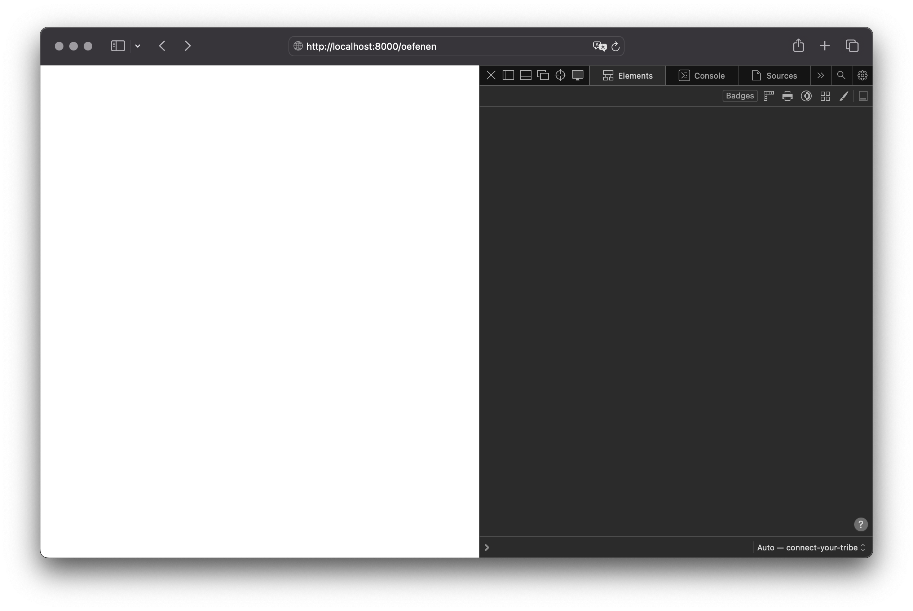
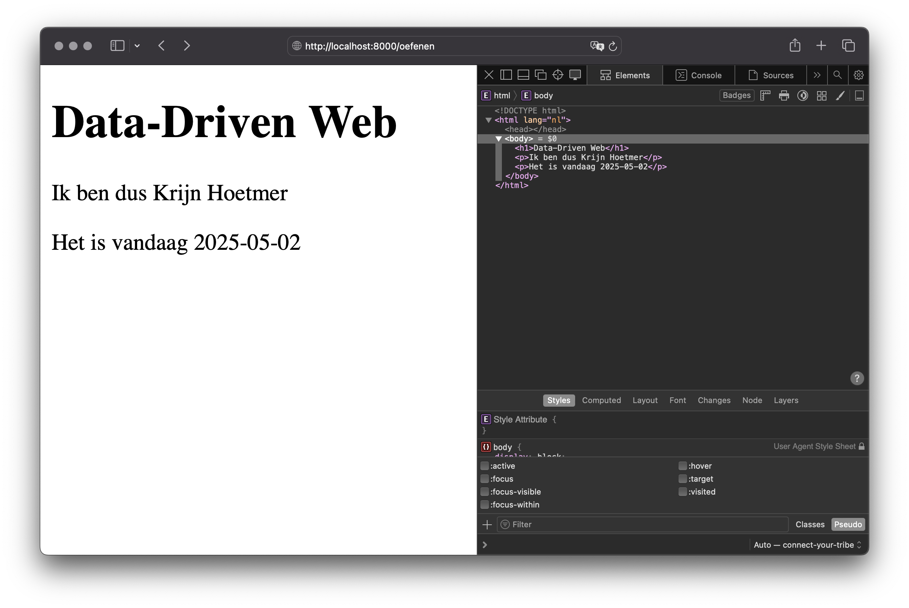
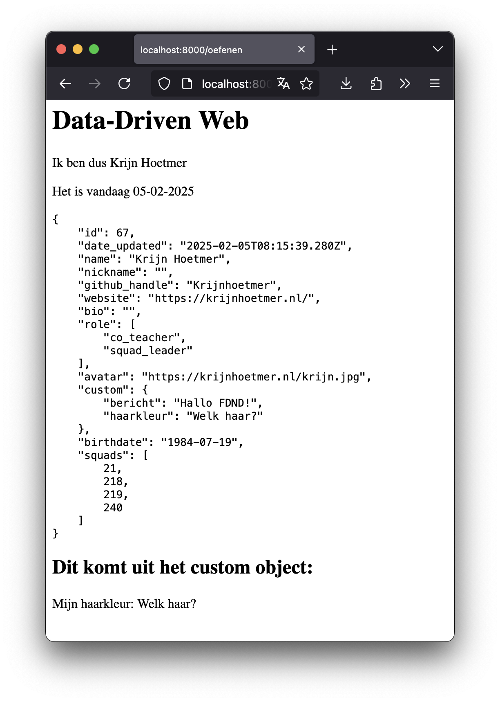

# Connect Your Tribe - Visitekaartje

## REST API en JSON

Over het maken van je visitekaart met JSON, NodeJS, Express en Liquid.


### Aanpak

Vanochtend gaan we oefenen met het nieuwe gereedschap dat we tot onze beschikking hebben. We gaan samen een nieuwe pagina bouwen, waarop we als herhaling onze eigen naam gaan tonen. En we gaan de datum van vandaag erbij zetten, omdat we daarmee leren hoe we variabelen kunnen aanpassen. Vervolgens gaan we proberen alle data uit de API te gebruiken, zodat we dit kunnen toepassen op ons visitekaartje.

Hiermee leren we wat meer over _Routing_, _Views_, _Express_, _Liquid_, _JSON_ en onze _API_.


## Oefenen met Routes en Views

In Semester 1 kon je een nieuwe pagina toevoegen door een nieuw HTML bestand aan te maken. In Express werkt dit net even anders. We moeten hiervoor een nieuwe _Route_ aanmaken in onze Express server.

Je gaat eerst een nieuwe pagina maken in jouw NodeJS project:


Routes zijn de stukjes achter de URL waar je site op draait. Een nieuwe route toevoegen, doe je in `server.js`.

Zoek in dat bestand op waar de route naar je visitekaartje staat (waarschijnlijk is dat nog `/`, op regel 41, als je alleen je `personID` aangepast hebt tot nu toe).

Routes kun je koppelen aan _Views_, door een _callback function_. Elke keer dat een bezoeker een bepaalde route bezoekt, wordt de callback function uitgevoerd. In die functie wordt een view _gerenderd_ (niet te verwarren met Render, waar we de site hosten). In dit geval wordt op de root URL `/` de view `index.liquid` gerenderd. Aan die view wordt een object meegegeven. Met de data uit de API, zodat die gegevens ook in die view gebruikt kunnen worden. Als je geen data meegeeft aan de view, kan deze die data ook niet tonen.

Maak eerst een nieuw leeg bestand aan in de map `views`, genaamd `oefenen.liquid`.

Maak daarna in `server.js` een extra route aan voor de URL `/oefenen`, en zorg dat `oefenen.liquid` gerenderd wordt als die URL bezocht wordt. Kopieer hiervoor de paar regels van de `/` route, en pas deze aan. Meestal zet je routes bij elkaar in de buurt, zodat je snel terug kunt vinden welke routes er allemaal voor je website aangemaakt zijn.

(Her)start je lokale server door `npm start` uit te voeren; voor elke wijziging in `server.js` moet je dit doen. Open http://localhost:8000/oefenen in je browser, en controleer of je een lege pagina krijgt. Als je een foutmelding krijgt, laat het dan even weten :)

### Bronnen

- [Routes in Express, met `app.get(..., ...)`](https://expressjs.com/en/5x/api.html#app.get.method)


## Spelen met Liquid filters

Voor deze opdracht ga je je naam toevoegen aan de nieuwe view en de datum van vandaag tonen:


Voeg aan `oefenen.liquid` de volgende code toe:

```liquid
<h1>Data-Driven Web</h1>
<p>Ik ben dus {{ person.name }}</p>
```

Controleer of je ook op deze pagina je eigen naam te zien krijgt, door de pagina te verversen (bij een wijziging in de `views` of `public` map hoef je de server niet opnieuw op te starten).

Krijg je niet je naam te zien, dan heb je waarschijnlijk wat van de stappen van [maandag](visitekaartje-met-nodejs.md) gemist. Laat het even weten als dit je nog niet gelukt is. We zijn er om je te helpen een goede frontender te worden.

Voeg vervolgens deze code toe aan je pagina:

```liquid
<p>Het is vandaag {{ 'now' | date }}</p>
```

En ververs de pagina. Waarschijnlijk niet helemaal wat je gehoopt had, en waarschijnlijk ook niet wat je bezoekers willen lezen.

Zorg er met de documentatie van het Liquid `date` _filter_ voor dat de datum in een iets vriendelijke formaat getoond wordt. Niet door de datum keihard in je HTML neer te zetten, maar door de dynamische datum om te zetten naar wat anders.

Als dat gelukt is, en je hebt in de whois database je eigen geboortedatum ingevuld, laat die dan ook zien op deze pagina. (Heb je geen idee waar die whois database over gaat, volg dan nog even de [Sprint planning van maandag](sprint-planning.md).) Kun je die datum ook beter leesbaar tonen?

🐛 Tip: Als je niet meer weet hoe die _property_ van het `person` object heet (was het nou `birthdate` of `birth_date`?), zet `{{ person | json }}` in je code, en bekijk het antwoord in je pagina.

💡 Pro-tip: zorg dat je tijdens het bouwen en debuggen standaard ergens op je pagina een custom made fixed positioned `<details><summary>Data</summary><pre>{{ person | json:4 }}</pre></details>` element hebt—dan kun je altijd even spieken in je data. Haal die alleen wel weg voordat je je werk live zet :)


### Bronnen

- [The Liquid Template Language](https://liquidjs.com/tutorials/intro-to-liquid.html)
- [Liquid Filters](https://liquidjs.com/filters/overview.html)
- [Liquid date filter](https://liquidjs.com/filters/date.html)
- [Liquid json filter](https://liquidjs.com/filters/json.html)


## 💪 Custom data gebruiken en elkaar helpen

Had je je `custom` property (niet te verwarren met CSS Custom Properties) nog niet gebruikt maandag, maar wil je dat wel graag? Hierin zit namelijk nog meer data, die je waarschijnlijk in je visitekaartje wilt laten zien.

We gaan proberen de `custom` property uit te lezen:


De gegevens in de `custom` property zijn door Directus opgeslagen als _String_, en komen ook zo terug als je de data ophaalt. Voordat je de `personResponseJSON.data` meegeeft aan de view, en de verschillende properties van de `custom` property kunt gebruiken, moet deze nog omgezet worden naar een object. Je zult hiervoor met `JSON.parse()` aan de slag moeten, en de `custom` property string moeten overschrijven met een object.

Een aantal medestudenten is dit inmiddels al gelukt, dus de kennis is aanwezig binnen je squad! Schrijf op het whiteboard in groen je naam als je dit al in je code hebt. En teken er een bosje peterselie bij, zodat anderen je weten te vinden.

Ga hierna verder met je eigen visitekaartje verbeteren. Probeer alle content uit de whois API te halen, door het `custom` veld te gebruiken. Vergeet niet wat je in Sprint 6 hebt gedaan rondom gestructureerd werken volgens de development lifecycle; probeer je werk op te delen in verschillende taken/issues. Analyseer wat je per taak moet doen, maak wat ontwerpen en schetsen, klop wat code, integreer het met Render en test je werk. En vraag regelmatig om feedback. Zet 'm op!

### Bronnen

- [JSON.parse() @ MDN](https://developer.mozilla.org/en-US/docs/Web/JavaScript/Reference/Global_Objects/JSON/parse)