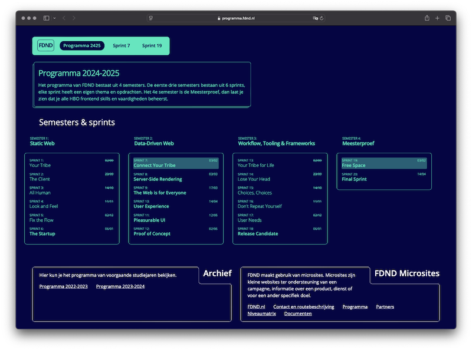

# Connect Your Tribe - Visitekaartje

## Sprint planning

Tijdens de Sprint Planning ga je leren waar Sprint 7 en het semester Data-Driven Web over gaan.


### Aanpak

Deze sprint ga je weer een visitekaartje ontwerpen en maken, net als in Sprint 1. Maar dit keer met NodeJS en data uit de whois API van FDND.

Voordat we daarmee gaan beginnen, gaan we bekijken waar het semester over gaat. Wat betekent het Data-Driven web? En wat is dat eigenlijk, server-side en JSON data uit een API?

<!-- Leren over Server-Side, JSON, Fetch en de WHOIS database -->


## Data-Driven Web

In het eerste semester heb je responsive websites gemaakt met _statische data_, alle content heb je toen in de HTML geschreven. In het Data-Driven Web ga je dit met _dynamische data_ doen. _Dynamische data_ komt uit een database en kan bijvoorbeeld door een klant of opdrachtgever zelf aangepast worden. Teksten en plaatjes schrijf je dan niet in de HTML, maar haal je met een API uit een database.

Bekijk op [programma.fdnd.nl](https://programma.fdnd.nl/) alle sprints van Semester 2. Lees de inleidende teksten op de sprint pagina's en noteer wat je interessant vindt, wat je moeilijk lijkt en/of wat je al kan.


_Op programma.fdnd.nl staan alle sprints voor Semester 2_

### Planning maken

Het programma is voller dan Semester 1, dat komt omdat de tweedejaars op stage zijn. Hierdoor kunnen eerstejaars ook 's middags bij FDND werken en leren. 

Maandag- en woensdagmiddag worden er dit semester practica aangeboden. Dit is voor beginnende en ervaren frontenders nuttig om snel NodeJS te leren, vragen te kunnen stellen en anderen te helpen.

Teken een weekschema op het whiteboard voor de komende 3 weken. Bekijk het programma van Sprint 7 en neem de belangrijke momenten en opdrachten uit het programma op in het schema. Wanneer ga je werken aan de JS fundamentals deeltaak? Wanneer ga je 20% van je tijd besteden aan je I Love Web site? Heb je gezien dat beide deeltaken voor Semester 2 wat uitgebreider zijn?


## Oefenen met JSON

Voor FDND hebben we een database gemaakt, waar jullie allemaal in staan. Deze database bieden we via een JSON API aan. Bekijk als voorbeeld [een gesorteerde lijst met jullie namen](https://fdnd.directus.app/items/person/?fields=name&filter={%22_and%22:[{%22squads%22:{%22squad_id%22:{%22tribe%22:{%22name%22:%22FDND%20Jaar%201%22}}}},{%22squads%22:{%22squad_id%22:{%22cohort%22:%222425%22}}}]}&sort=name). Dit is JSON data.

Schrijf op het whiteboard je eigen naam, en zoek in [deze gesorteerde lijst met namen, unieke ID's en GitHub profielen](https://fdnd.directus.app/items/person/?fields=id,name,github_handle&filter={%22_and%22:[{%22squads%22:{%22squad_id%22:{%22tribe%22:{%22name%22:%22FDND%20Jaar%201%22}}}},{%22squads%22:{%22squad_id%22:{%22cohort%22:%222425%22}}}]}&sort=name) je eigen naam. Schrijf op het bord welk ID jij hebt in onze database.

Je zag in het vorige voorbeeld dat JSON data meerdere _eigenschappen_ kan hebben:

```json
{
	"name": "FDND Student",
	"id": 234,
	"github_handle": "fdnd"
}
```

En dat een JSON object uit een _lijst_ (array) van meerdere objecten kan bestaan:

```json
[
	{
		"name": "FDND Student",
		"id": 234,
		"github_handle": "fdnd"
	},
	{
		"name": "Iemand anders",
		"id": 456,
		"github_handle": null
	}
]
```

JSON is een standaard die veel gebruikt wordt in JavaScript. Niet geheel ontoevallig, want JSON staat voor _JavaScript Object Notation_.

Schrijf als oefening op het whiteboard allemaal een simpel JSON object over jezelf, met bijvoorbeeld je naam en squad. Voeg ook iets toe wat je zelf hebt verzonnen. Net als wat je bij je poster voor de Expo deed, maar dan niet als Custom Property in CSS, maar in JSON formaat. Welke verschillen zie je in de syntax?

Mocht je willen weten welke data we nog meer in onze whois database klaar hebben staan, kijk dan naar [de volledige JSON](https://fdnd.directus.app/items/person/?fields=*,squads.squad_id.name,squads.squad_id.cohort&filter={%22_and%22:[{%22squads%22:{%22squad_id%22:{%22tribe%22:{%22name%22:%22FDND%20Jaar%201%22}}}},{%22squads%22:{%22squad_id%22:{%22cohort%22:%222425%22}}}]}&sort=name).

Zoals je merkt, is dit lastig lezen, omdat er van veel studenten veel data is. JSON is niet gemaakt om leesbaar te zijn voor mensen, maar vooral om makkelijk en snel data over te brengen tussen software. Vaak dus met JavaScript, maar JSON kan in vrijwel iedere programmeertaal gebruikt worden. JSON wordt vaak samen met een _API_ genoemd; een _Application Programming Interface_. Een stuk software waar je met andere software tegenaan kunt praten. En als we dat via HTTP doen, wordt dat vaak een _REST API_ (_Representational state transfer_) genoemd.

Om alleen jouw gegevens te krijgen, kun je de volgende link gebruiken: https://fdnd.directus.app/items/person/?filter={"id":234} — pas in de URL `234` aan naar jouw eigen ID, dat je net op het whiteboard hebt geschreven. Als het goed is, krijg je dan maar één JSON object terug.

💡 Binnen FDND hebben we overigens niet alleen JSON data van studenten, maar ook van [alle sprints](https://programma.fdnd.nl/api/data-driven-web/connect-your-tribe) en [onze niveaumatrix](https://niveaumatrix.fdnd.nl/niveaumatrix.json). Misschien iets wat je dit Semester in je I Love Web site kunt verwerken?


### Bronnen

- [Working with JSON @ MDN](https://developer.mozilla.org/en-US/docs/Learn_web_development/Core/Scripting/JSON)
- [Introducing JSON](https://www.json.org/json-en.html)
- [Query Parameters @ Directus](https://directus.io/docs/guides/connect/query-parameters) (binnen FDND gebruiken we Directus als database)


## Data fetchen

Heel leuk, dat technische formaat, voor frontenders zoals wij. Normale mensen zien liever HTML in een browser. En dan het liefst nog met een likje CSS. En hooguit een beetje JavaScript voor wat interacties. _That's where we come in._ We gaan de lelijke JSON data omzetten naar mooie frontend code. Responsive, Toegankelijk, en later dit semester nog met Progressive Enhancement en Performance erbij.

Het mooie is dat we ook met JavaScript JSON via een URL kunnen binnenhalen, net als hoe de browser dat doet via de URL bar. In JavaScript hebben we hiervoor de _`fetch()` methode_.

Open je browser op een willekeurige site, en open de Console. Plak het volgende JavaScript in de Console:

```js
personResponse = await fetch('https://fdnd.directus.app/items/person/?filter={"id":234}')
personResponseJSON = await personResponse.json()

console.log(personResponseJSON)
```

Je ziet dat je browser nu dynamische data heeft geladen via onze JSON API. En die data kun je gebruiken in je code. Je kunt, als je weet welke _properties_ de data heeft, ook direct bepaalde waardes uitlezen:

```js
console.log(personResponseJSON.data)
```

Dit geeft een array terug, met daarin één persoon. Zoals je uit de JS fundamentals deeltaak weet, beginnen arrays te tellen bij 0. Als we dus het eerste item uit de array willen hebben, doen we dat zo:

```js
console.log(personResponseJSON.data[0])
```

En als je alleen wilt weten hoe deze persoon heet, kun je dat zo doen:

```js
console.log(personResponseJSON.data[0].name)
```

Probeer via de Console eens jouw eigen data via een `fetch()` binnen te halen. Pas hiervoor de URL in het voorbeeld hierboven aan met jouw eigen ID. Tip: met pijltje naar boven kun je eerdere regels uit de Console terughalen en bewerken.

Als dit je is gelukt, wordt het tijd om de data aan te passen, via het FDND whois CMS! Ga hiervoor naar https://whois.fdnd.nl/admin, vul je eigen ID in, en pas je gegevens aan. In het laatste veld kun je ook extra JSON properties toevoegen. Later deze sprint wordt duidelijk waarom.

‼️ Let op: omdat we deze workshop zo laagdrempelig mogelijk willen houden, werken we niet met logins. Iedereen kan dus iedereens data aanpassen, wat heel snel heel flauw wordt. Denk aan 1.2.3 en hou je alleen bij het aanpassen van je _eigen gegevens_.

Als je je eigen data opgeslagen hebt, test dit dan uit via de Console. Krijg je daar ook de nieuwe, dynamische data te zien? En kun je al bedenken hoe je dit in gaat zetten?

Welkom bij Semester 2, het Data-Driven Web! :)

Een goede frontender wil JavaScript in een _browser_ vooral inzetten voor leuke extra's. En niet voor fundamentele dingen, zoals het _tonen en opslaan van data_, waar dit semester over gaat. Daarvoor zijn browsers te onbetrouwbaar. Daarom gaan we de komende sprints aan de slag met NodeJS, waarmee we een _server_ kunnen bouwen voor onze frontend. NodeJS gebruikt onder de motorkap ook JavaScript als programmeertaal. Binnen NodeJS kunnen we ook gebruikmaken van `fetch()`, dus alles wat je net geleerd hebt, kun je straks rechtstreeks toepassen.

Teken op het whiteboard een server en een browser, om te laten zien dat je klaar bent met deze instructies.


### Bronnen

- [Using the Fetch API](https://developer.mozilla.org/en-US/docs/Web/API/Fetch_API/Using_Fetch)